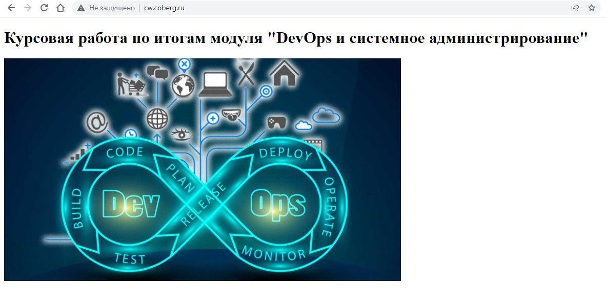
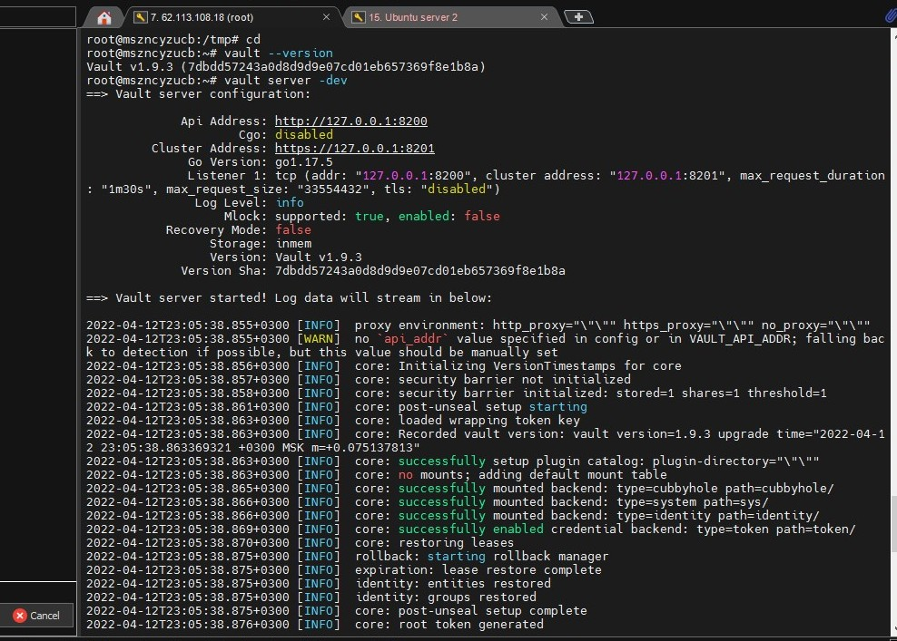
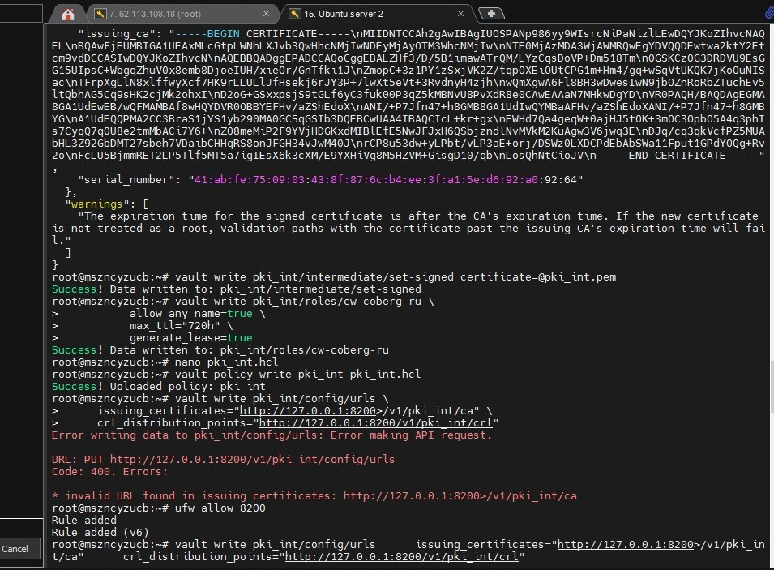

#Курсовая работа по итогам модуля "DevOps и системное администрирование"

##Задание
(1) Создайте виртуальную машину Linux.

Делаю на VPS, надеюсь это не будет считаться ошибкой.



(2) Установите ufw и разрешите к этой машине сессии на порты 22 и 443, при этом трафик на интерфейсе localhost (lo) должен ходить свободно на все порты.

```
root@mszncyzucb:/usr/local/src/nginx-1.20.2# apt install ufw
Reading package lists... Done
Building dependency tree
Reading state information... Done
ufw is already the newest version (0.36-6ubuntu1).
ufw set to manually installed.
0 upgraded, 0 newly installed, 0 to remove and 9 not upgraded.
root@mszncyzucb:/usr/local/src/nginx-1.20.2# nano /etc/ufw/applications.d/nginx.ini
root@mszncyzucb:/usr/local/src/nginx-1.20.2# ufw app list
Available applications:
  Nginx Full
  Nginx HTTP
  Nginx HTTPS
  OpenSSH
root@mszncyzucb:/usr/local/src/nginx-1.20.2# ufw enable
Command may disrupt existing ssh connections. Proceed with operation (y|n)? y
Firewall is active and enabled on system startup
root@mszncyzucb:/usr/local/src/nginx-1.20.2# ufw allow 'Nginx Full'
Rule added
Rule added (v6)
root@mszncyzucb:/usr/local/src/nginx-1.20.2# ufw allow 'OpenSSH'
Rule added
Rule added (v6)
root@mszncyzucb:/usr/local/src/nginx-1.20.2# ufw status
Status: active

To                         Action      From
--                         ------      ----
Nginx Full                 ALLOW       Anywhere
OpenSSH                    ALLOW       Anywhere
Nginx Full (v6)            ALLOW       Anywhere (v6)
OpenSSH (v6)               ALLOW       Anywhere (v6)

root@mszncyzucb:/usr/local/src/nginx-1.20.2# ip addr
1: lo: <LOOPBACK,UP,LOWER_UP> mtu 65536 qdisc noqueue state UNKNOWN group default qlen 1000
    link/loopback 00:00:00:00:00:00 brd 00:00:00:00:00:00
    inet 127.0.0.1/8 scope host lo
       valid_lft forever preferred_lft forever
    inet6 ::1/128 scope host
       valid_lft forever preferred_lft forever
2: eth0: <BROADCAST,MULTICAST,UP,LOWER_UP> mtu 1500 qdisc fq_codel state UP group default qle                 n 1000
    link/ether 00:17:27:60:b0:ee brd ff:ff:ff:ff:ff:ff
    inet 62.113.108.18/32 brd 62.113.108.18 scope global eth0
       valid_lft forever preferred_lft forever
    inet6 fe80::217:27ff:fe60:b0ee/64 scope link
       valid_lft forever preferred_lft forever
root@mszncyzucb:/usr/local/src/nginx-1.20.2# ufw allow in on lo
Rule added
Rule added (v6)
root@mszncyzucb:/usr/local/src/nginx-1.20.2# ufw status
Status: active

To                         Action      From
--                         ------      ----
Nginx Full                 ALLOW       Anywhere
OpenSSH                    ALLOW       Anywhere
Anywhere on lo             ALLOW       Anywhere
Nginx Full (v6)            ALLOW       Anywhere (v6)
OpenSSH (v6)               ALLOW       Anywhere (v6)
Anywhere (v6) on lo        ALLOW       Anywhere (v6)

```

(3) Установите hashicorp vault (инструкция по ссылке).

```
root@mszncyzucb:~# cd /tmp/ && wget https://hashicorp-releases.website.yandexcloud.net/vault/1.9.3/vault_1.9.3
--2022-04-12 19:58:51--  https://hashicorp-releases.website.yandexcloud.net/vault/1.9.3/vault_1.9.3_linux_amd6
Resolving hashicorp-releases.website.yandexcloud.net (hashicorp-releases.website.yandexcloud.net)... 213.180.1
Connecting to hashicorp-releases.website.yandexcloud.net (hashicorp-releases.website.yandexcloud.net)|213.180.
HTTP request sent, awaiting response... 200 OK
Length: 68962699 (66M) [application/zip]
Saving to: ‘vault_1.9.3_linux_amd64.zip’

vault_1.9.3_linux_amd64.zip             100%[=================================================================

Last-modified header invalid -- time-stamp ignored.
2022-04-12 19:58:56 (15.6 MB/s) - ‘vault_1.9.3_linux_amd64.zip’ saved [68962699/68962699]

root@mszncyzucb:/tmp# systemctl enable chrony
Failed to enable unit: Unit file chrony.service does not exist.
root@mszncyzucb:/tmp# apt-get install wget chrony curl apt-transport-https
Reading package lists... Done
Building dependency tree
Reading state information... Done
curl is already the newest version (7.68.0-1ubuntu2.7).
wget is already the newest version (1.20.3-1ubuntu2).
apt-transport-https is already the newest version (2.0.6).
The following packages will be REMOVED:
  systemd-timesyncd
The following NEW packages will be installed:
  chrony
0 upgraded, 1 newly installed, 1 to remove and 11 not upgraded.
Need to get 220 kB of archives.
After this operation, 286 kB of additional disk space will be used.
Do you want to continue? [Y/n] y
Get:1 http://archive.ubuntu.com/ubuntu focal-updates/main amd64 chrony amd64 3.5-6ubuntu6.2 [220 kB]
Fetched 220 kB in 1s (406 kB/s)
dpkg: systemd-timesyncd: dependency problems, but removing anyway as you requested:
 systemd depends on systemd-timesyncd | time-daemon; however:
  Package systemd-timesyncd is to be removed.
  Package time-daemon is not installed.
  Package systemd-timesyncd which provides time-daemon is to be removed.
 systemd depends on systemd-timesyncd | time-daemon; however:
  Package systemd-timesyncd is to be removed.
  Package time-daemon is not installed.
  Package systemd-timesyncd which provides time-daemon is to be removed.

(Reading database ... 106828 files and directories currently installed.)
Removing systemd-timesyncd (245.4-4ubuntu3.15) ...
Selecting previously unselected package chrony.
(Reading database ... 106815 files and directories currently installed.)
Preparing to unpack .../chrony_3.5-6ubuntu6.2_amd64.deb ...
Unpacking chrony (3.5-6ubuntu6.2) ...
Setting up chrony (3.5-6ubuntu6.2) ...
Creating '_chrony' system user/group for the chronyd daemon…

Creating config file /etc/chrony/chrony.conf with new version

Creating config file /etc/chrony/chrony.keys with new version
Created symlink /etc/systemd/system/chronyd.service → /lib/systemd/system/chrony.service.
Created symlink /etc/systemd/system/multi-user.target.wants/chrony.service → /lib/systemd/system/chrony.service.
Processing triggers for man-db (2.9.1-1) ...
Processing triggers for dbus (1.12.16-2ubuntu2.1) ...
Processing triggers for systemd (245.4-4ubuntu3.15) ...
root@mszncyzucb:/tmp# timedatectl set-timezone Europe/Moscow
root@mszncyzucb:/tmp# systemctl enable chrony
Synchronizing state of chrony.service with SysV service script with /lib/systemd/systemd-sysv-install.
Executing: /lib/systemd/systemd-sysv-install enable chrony
root@mszncyzucb:/tmp# systemctl restart chrony
root@mszncyzucb:/tmp# unzip vault_1.9.3_linux_amd64.zip’
unzip:  cannot find or open vault_1.9.3_linux_amd64.zip’, vault_1.9.3_linux_amd64.zip’.zip or vault_1.9.3_linux_amd64.zip’.ZIP.
root@mszncyzucb:/tmp# unzip vault_1.9.3_linux_amd64.zip
Archive:  vault_1.9.3_linux_amd64.zip
  inflating: vault
root@mszncyzucb:/tmp# ls -l vault
-rwxr-xr-x 1 root root 187665656 Jan 25 01:18 vault
root@mszncyzucb:/tmp# mv vault /usr/local/bin/
root@mszncyzucb:/tmp# ls
systemd-private-bd76f79899794b8e8c3d13cb2228c739-chrony.service-jLHkSi
systemd-private-bd76f79899794b8e8c3d13cb2228c739-fwupd.service-4YwGOh
systemd-private-bd76f79899794b8e8c3d13cb2228c739-ModemManager.service-tBY5cf
systemd-private-bd76f79899794b8e8c3d13cb2228c739-systemd-logind.service-Ey6bMh
systemd-private-bd76f79899794b8e8c3d13cb2228c739-systemd-resolved.service-u0U8Pg
vault_1.9.3_linux_amd64.zip
root@mszncyzucb:/tmp# rm vault_1.9.3_linux_amd64.zip
root@mszncyzucb:/tmp# ls
systemd-private-bd76f79899794b8e8c3d13cb2228c739-chrony.service-jLHkSi
systemd-private-bd76f79899794b8e8c3d13cb2228c739-fwupd.service-4YwGOh
systemd-private-bd76f79899794b8e8c3d13cb2228c739-ModemManager.service-tBY5cf
systemd-private-bd76f79899794b8e8c3d13cb2228c739-systemd-logind.service-Ey6bMh
systemd-private-bd76f79899794b8e8c3d13cb2228c739-systemd-resolved.service-u0U8Pg
root@mszncyzucb:/tmp# cd
root@mszncyzucb:~# vault --version
Vault v1.9.3 (7dbdd57243a0d8d9d9e07cd01eb657369f8e1b8a)
root@mszncyzucb:~# vault server -dev
==> Vault server configuration:

             Api Address: http://127.0.0.1:8200
                     Cgo: disabled
         Cluster Address: https://127.0.0.1:8201
              Go Version: go1.17.5
              Listener 1: tcp (addr: "127.0.0.1:8200", cluster address: "127.0.0.1:8201", max_request_duration: "1m30s", max_request_size: "33554432", tls: "disabled")
               Log Level: info
                   Mlock: supported: true, enabled: false
           Recovery Mode: false
                 Storage: inmem
                 Version: Vault v1.9.3
             Version Sha: 7dbdd57243a0d8d9d9e07cd01eb657369f8e1b8a

==> Vault server started! Log data will stream in below:

2022-04-12T23:05:38.855+0300 [INFO]  proxy environment: http_proxy="\"\"" https_proxy="\"\"" no_proxy="\"\""
2022-04-12T23:05:38.855+0300 [WARN]  no `api_addr` value specified in config or in VAULT_API_ADDR; falling back to detection if possible, but this value should be manually set
2022-04-12T23:05:38.856+0300 [INFO]  core: Initializing VersionTimestamps for core
2022-04-12T23:05:38.857+0300 [INFO]  core: security barrier not initialized
2022-04-12T23:05:38.858+0300 [INFO]  core: security barrier initialized: stored=1 shares=1 threshold=1
2022-04-12T23:05:38.861+0300 [INFO]  core: post-unseal setup starting
2022-04-12T23:05:38.863+0300 [INFO]  core: loaded wrapping token key
2022-04-12T23:05:38.863+0300 [INFO]  core: Recorded vault version: vault version=1.9.3 upgrade time="2022-04-12 23:05:38.863369321 +0300 MSK m=+0.075137813"
2022-04-12T23:05:38.863+0300 [INFO]  core: successfully setup plugin catalog: plugin-directory="\"\""
2022-04-12T23:05:38.863+0300 [INFO]  core: no mounts; adding default mount table
2022-04-12T23:05:38.865+0300 [INFO]  core: successfully mounted backend: type=cubbyhole path=cubbyhole/
2022-04-12T23:05:38.866+0300 [INFO]  core: successfully mounted backend: type=system path=sys/
2022-04-12T23:05:38.866+0300 [INFO]  core: successfully mounted backend: type=identity path=identity/
2022-04-12T23:05:38.869+0300 [INFO]  core: successfully enabled credential backend: type=token path=token/
2022-04-12T23:05:38.870+0300 [INFO]  core: restoring leases
2022-04-12T23:05:38.875+0300 [INFO]  rollback: starting rollback manager
2022-04-12T23:05:38.875+0300 [INFO]  expiration: lease restore complete
2022-04-12T23:05:38.875+0300 [INFO]  identity: entities restored
2022-04-12T23:05:38.875+0300 [INFO]  identity: groups restored
2022-04-12T23:05:38.875+0300 [INFO]  core: post-unseal setup complete
2022-04-12T23:05:38.876+0300 [INFO]  core: root token generated
2022-04-12T23:05:38.876+0300 [INFO]  core: pre-seal teardown starting
2022-04-12T23:05:38.877+0300 [INFO]  rollback: stopping rollback manager
2022-04-12T23:05:38.877+0300 [INFO]  core: pre-seal teardown complete
2022-04-12T23:05:38.877+0300 [INFO]  core.cluster-listener.tcp: starting listener: listener_address=127.0.0.1:8201
2022-04-12T23:05:38.877+0300 [INFO]  core.cluster-listener: serving cluster requests: cluster_listen_address=127.0.0.1:8201
2022-04-12T23:05:38.877+0300 [INFO]  core: post-unseal setup starting
2022-04-12T23:05:38.878+0300 [INFO]  core: loaded wrapping token key
2022-04-12T23:05:38.878+0300 [INFO]  core: successfully setup plugin catalog: plugin-directory="\"\""
2022-04-12T23:05:38.878+0300 [INFO]  core: successfully mounted backend: type=system path=sys/
2022-04-12T23:05:38.879+0300 [INFO]  core: successfully mounted backend: type=identity path=identity/
2022-04-12T23:05:38.879+0300 [INFO]  core: successfully mounted backend: type=cubbyhole path=cubbyhole/
2022-04-12T23:05:38.880+0300 [INFO]  core: successfully enabled credential backend: type=token path=token/
2022-04-12T23:05:38.881+0300 [INFO]  core: restoring leases
2022-04-12T23:05:38.884+0300 [INFO]  expiration: lease restore complete
2022-04-12T23:05:38.884+0300 [INFO]  identity: entities restored
2022-04-12T23:05:38.884+0300 [INFO]  identity: groups restored
2022-04-12T23:05:38.884+0300 [INFO]  core: post-unseal setup complete
2022-04-12T23:05:38.884+0300 [INFO]  core: vault is unsealed
2022-04-12T23:05:38.887+0300 [INFO]  core: successful mount: namespace="\"\"" path=secret/ type=kv
2022-04-12T23:05:38.891+0300 [INFO]  secrets.kv.kv_1a219856: collecting keys to upgrade
2022-04-12T23:05:38.891+0300 [INFO]  secrets.kv.kv_1a219856: done collecting keys: num_keys=1
2022-04-12T23:05:38.891+0300 [INFO]  secrets.kv.kv_1a219856: upgrading keys finished
2022-04-12T23:05:38.892+0300 [INFO]  rollback: starting rollback manager
WARNING! dev mode is enabled! In this mode, Vault runs entirely in-memory
and starts unsealed with a single unseal key. The root token is already
authenticated to the CLI, so you can immediately begin using Vault.

You may need to set the following environment variable:

    $ export VAULT_ADDR='http://127.0.0.1:8200'

The unseal key and root token are displayed below in case you want to
seal/unseal the Vault or re-authenticate.

Unseal Key: b9g44hBR3Cj9QXyAM3GJZsX1ShGW3scxeNTltuf5onE=
Root Token: s.LSnpuvvEq2nIQXHwBMFZSzHq

Development mode should NOT be used in production installations!

```

(4) Cоздайте центр сертификации по инструкции (ссылка) и выпустите сертификат для использования его в настройке веб-сервера nginx (срок жизни сертификата - месяц).

Чтото не выходит у меня с центром сертификации, раз пять уже делал, ошибки лезут и все тут. Подскажите куда копать.








(5) Установите корневой сертификат созданного центра сертификации в доверенные в хостовой системе.

Лезут ошибки и все тут:

Error writing data to pki_int/config/urls: Error making API request.

URL: PUT http://127.0.0.1:8200/v1/pki_int/config/urls
Code: 400. Errors:

* invalid URL found in issuing certificates: http://127.0.0.1:8200>/v1/pki_int/ca

```
root@mszncyzucb:~# export VAULT_ADDR='http://127.0.0.1:8200'
root@mszncyzucb:~# vault login
Token (will be hidden):
Success! You are now authenticated. The token information displayed below
is already stored in the token helper. You do NOT need to run "vault login"
again. Future Vault requests will automatically use this token.

Key                  Value
---                  -----
token                s.LSnpuvvEq2nIQXHwBMFZSzHq
token_accessor       x99ZxmxklUPM1JjYve3eZHdq
token_duration       ∞
token_renewable      false
token_policies       ["root"]
identity_policies    []
policies             ["root"]
root@mszncyzucb:~# apt install jq
Reading package lists... Done
Building dependency tree
Reading state information... Done
The following additional packages will be installed:
  libjq1 libonig5
The following NEW packages will be installed:
  jq libjq1 libonig5
0 upgraded, 3 newly installed, 0 to remove and 11 not upgraded.
Need to get 313 kB of archives.
After this operation, 1,062 kB of additional disk space will be used.
Do you want to continue? [Y/n] y
Get:1 http://archive.ubuntu.com/ubuntu focal/universe amd64 libonig5 amd64 6.9.4-1 [142 kB]
Get:2 http://archive.ubuntu.com/ubuntu focal-updates/universe amd64 libjq1 amd64 1.6-1ubuntu0.20.04.1 [121 kB]
Get:3 http://archive.ubuntu.com/ubuntu focal-updates/universe amd64 jq amd64 1.6-1ubuntu0.20.04.1 [50.2 kB]
Fetched 313 kB in 1s (419 kB/s)
Selecting previously unselected package libonig5:amd64.
(Reading database ... 106857 files and directories currently installed.)
Preparing to unpack .../libonig5_6.9.4-1_amd64.deb ...
Unpacking libonig5:amd64 (6.9.4-1) ...
Selecting previously unselected package libjq1:amd64.
Preparing to unpack .../libjq1_1.6-1ubuntu0.20.04.1_amd64.deb ...
Unpacking libjq1:amd64 (1.6-1ubuntu0.20.04.1) ...
Selecting previously unselected package jq.
Preparing to unpack .../jq_1.6-1ubuntu0.20.04.1_amd64.deb ...
Unpacking jq (1.6-1ubuntu0.20.04.1) ...
Setting up libonig5:amd64 (6.9.4-1) ...
Setting up libjq1:amd64 (1.6-1ubuntu0.20.04.1) ...
Setting up jq (1.6-1ubuntu0.20.04.1) ...
Processing triggers for man-db (2.9.1-1) ...
Processing triggers for libc-bin (2.31-0ubuntu9.7) ...
root@mszncyzucb:~# vault status
Key             Value
---             -----
Seal Type       shamir
Initialized     true
Sealed          false
Total Shares    1
Threshold       1
Version         1.9.3
Storage Type    inmem
Cluster Name    vault-cluster-8ce03ab9
Cluster ID      dd1349ff-a75f-8c0c-fba8-a50a1555c296
HA Enabled      false
root@mszncyzucb:~# cd
root@mszncyzucb:~# vault secrets enable pki
Success! Enabled the pki secrets engine at: pki/
root@mszncyzucb:~# vault write -format=json pki/root/generate/internal \
>  common_name="pki-ca-root" ttl=87600h | tee \
> >(jq -r .data.certificate > ca.pem) \
> >(jq -r .data.issuing_ca > issuing_ca.pem) \
> >(jq -r .data.private_key > ca-key.pem)
{
  "request_id": "2b82bb98-7ae2-1916-3626-e8fa0b6a7dd7",
  "lease_id": "",
  "lease_duration": 0,
  "renewable": false,
  "data": {
    "certificate": "-----BEGIN CERTIFICATE-----\nMIIDNTCCAh2gAwIBAgIUOSPANp986yy9WIsrcNiPaNizlLEwDQYJKoZIhvcNAQEL\nBQAwFjEUMBIGA1UEAxMLcGtpLWNhLXJvb3QwHhcNMjIwNDEyMjAyOTM3WhcNMjIw\nNTE0MjAzMDA3WjAWMRQwEgYDVQQDEwtwa2ktY2Etcm9vdDCCASIwDQYJKoZIhvcN\nAQEBBQADggEPADCCAQoCggEBALZHf3/D/5B1imawATrQM/LYzCqsDoVP+Dm518Tm\n0GSKCz0G3DRDVU9EsGG15UIpsC+WbgqZhuV0x8emb8DjoeIUH/xieOr/GnTfki1J\nZmopC+3z1PY1zSxjVK2Z/tqpOXEiOUtCPG1m+Hm4/gq+wSqVtUKQK7jKoOuNISac\nTFrpXgLlN8xlffwyXcf7HK9rLLULlJfHsekj6rJY3P+7lwXt5eVt+3RvdnyH4zjh\nwQmXgwA6Fl8BH3wDwesIwN9jbOZnRoRbZTuchEv5ltQbhAG5Cq9sHK2cjMk2ohxI\nD2oG+GSxxpsjS9tGLf6yC3fuk00P3qZ5kMBNvU8PvXdR8e0CAwEAAaN7MHkwDgYD\nVR0PAQH/BAQDAgEGMA8GA1UdEwEB/wQFMAMBAf8wHQYDVR0OBBYEFHv/aZShEdoX\nANI/+P7Jfn47+h8GMB8GA1UdIwQYMBaAFHv/aZShEdoXANI/+P7Jfn47+h8GMBYG\nA1UdEQQPMA2CC3BraS1jYS1yb290MA0GCSqGSIb3DQEBCwUAA4IBAQCIcL+kr+gx\nEWHd7Qa4geqW+0ajHJ5tOK+3mOC3OpbO5A4q3phIs7CyqQ7q0U8e2tmMbACi7Y6+\nZO8meMiP2F9YVjHDGKxdMIBlEfE5NwJFJxH6QSbjzndlNvMVkM2KuAgw3V6jwq3E\nDJq/cq3qkVcfPZ5MUAbHL3Z92GbDMT27sbeh7VDaibCHHqRS8onJFGH34vJwM40J\nrCP8u53dw+yLPbt/vLP3aE+orj/DSWz0LXDCPdEbAbSWa11Fput1GPdYOQg+Rv2o\nFcLU5BjmmRET2LP5Tlf5MT5a7igIEsX6k3cXM/E9YXHiVg8M5HZVM+GisgD10/qb\nLosQhNtCioJV\n-----END CERTIFICATE-----",
    "expiration": 1652560207,
    "issuing_ca": "-----BEGIN CERTIFICATE-----\nMIIDNTCCAh2gAwIBAgIUOSPANp986yy9WIsrcNiPaNizlLEwDQYJKoZIhvcNAQEL\nBQAwFjEUMBIGA1UEAxMLcGtpLWNhLXJvb3QwHhcNMjIwNDEyMjAyOTM3WhcNMjIw\nNTE0MjAzMDA3WjAWMRQwEgYDVQQDEwtwa2ktY2Etcm9vdDCCASIwDQYJKoZIhvcN\nAQEBBQADggEPADCCAQoCggEBALZHf3/D/5B1imawATrQM/LYzCqsDoVP+Dm518Tm\n0GSKCz0G3DRDVU9EsGG15UIpsC+WbgqZhuV0x8emb8DjoeIUH/xieOr/GnTfki1J\nZmopC+3z1PY1zSxjVK2Z/tqpOXEiOUtCPG1m+Hm4/gq+wSqVtUKQK7jKoOuNISac\nTFrpXgLlN8xlffwyXcf7HK9rLLULlJfHsekj6rJY3P+7lwXt5eVt+3RvdnyH4zjh\nwQmXgwA6Fl8BH3wDwesIwN9jbOZnRoRbZTuchEv5ltQbhAG5Cq9sHK2cjMk2ohxI\nD2oG+GSxxpsjS9tGLf6yC3fuk00P3qZ5kMBNvU8PvXdR8e0CAwEAAaN7MHkwDgYD\nVR0PAQH/BAQDAgEGMA8GA1UdEwEB/wQFMAMBAf8wHQYDVR0OBBYEFHv/aZShEdoX\nANI/+P7Jfn47+h8GMB8GA1UdIwQYMBaAFHv/aZShEdoXANI/+P7Jfn47+h8GMBYG\nA1UdEQQPMA2CC3BraS1jYS1yb290MA0GCSqGSIb3DQEBCwUAA4IBAQCIcL+kr+gx\nEWHd7Qa4geqW+0ajHJ5tOK+3mOC3OpbO5A4q3phIs7CyqQ7q0U8e2tmMbACi7Y6+\nZO8meMiP2F9YVjHDGKxdMIBlEfE5NwJFJxH6QSbjzndlNvMVkM2KuAgw3V6jwq3E\nDJq/cq3qkVcfPZ5MUAbHL3Z92GbDMT27sbeh7VDaibCHHqRS8onJFGH34vJwM40J\nrCP8u53dw+yLPbt/vLP3aE+orj/DSWz0LXDCPdEbAbSWa11Fput1GPdYOQg+Rv2o\nFcLU5BjmmRET2LP5Tlf5MT5a7igIEsX6k3cXM/E9YXHiVg8M5HZVM+GisgD10/qb\nLosQhNtCioJV\n-----END CERTIFICATE-----",
    "serial_number": "39:23:c0:36:9f:7c:eb:2c:bd:58:8b:2b:70:d8:8f:68:d8:b3:94:b1"
  },
  "warnings": null
}
root@mszncyzucb:~# curl -s http://127.0.0.1:8200/v1/pki/ca/pem | openssl x509 -text
Certificate:
    Data:
        Version: 3 (0x2)
        Serial Number:
            39:23:c0:36:9f:7c:eb:2c:bd:58:8b:2b:70:d8:8f:68:d8:b3:94:b1
        Signature Algorithm: sha256WithRSAEncryption
        Issuer: CN = pki-ca-root
        Validity
            Not Before: Apr 12 20:29:37 2022 GMT
            Not After : May 14 20:30:07 2022 GMT
        Subject: CN = pki-ca-root
        Subject Public Key Info:
            Public Key Algorithm: rsaEncryption
                RSA Public-Key: (2048 bit)
                Modulus:
                    00:b6:47:7f:7f:c3:ff:90:75:8a:66:b0:01:3a:d0:
                    33:f2:d8:cc:2a:ac:0e:85:4f:f8:39:b9:d7:c4:e6:
                    d0:64:8a:0b:3d:06:dc:34:43:55:4f:44:b0:61:b5:
                    e5:42:29:b0:2f:96:6e:0a:99:86:e5:74:c7:c7:a6:
                    6f:c0:e3:a1:e2:14:1f:fc:62:78:ea:ff:1a:74:df:
                    92:2d:49:66:6a:29:0b:ed:f3:d4:f6:35:cd:2c:63:
                    54:ad:99:fe:da:a9:39:71:22:39:4b:42:3c:6d:66:
                    f8:79:b8:fe:0a:be:c1:2a:95:b5:42:90:2b:b8:ca:
                    a0:eb:8d:21:26:9c:4c:5a:e9:5e:02:e5:37:cc:65:
                    7d:fc:32:5d:c7:fb:1c:af:6b:2c:b5:0b:94:97:c7:
                    b1:e9:23:ea:b2:58:dc:ff:bb:97:05:ed:e5:e5:6d:
                    fb:74:6f:76:7c:87:e3:38:e1:c1:09:97:83:00:3a:
                    16:5f:01:1f:7c:03:c1:eb:08:c0:df:63:6c:e6:67:
                    46:84:5b:65:3b:9c:84:4b:f9:96:d4:1b:84:01:b9:
                    0a:af:6c:1c:ad:9c:8c:c9:36:a2:1c:48:0f:6a:06:
                    f8:64:b1:c6:9b:23:4b:db:46:2d:fe:b2:0b:77:ee:
                    93:4d:0f:de:a6:79:90:c0:4d:bd:4f:0f:bd:77:51:
                    f1:ed
                Exponent: 65537 (0x10001)
        X509v3 extensions:
            X509v3 Key Usage: critical
                Certificate Sign, CRL Sign
            X509v3 Basic Constraints: critical
                CA:TRUE
            X509v3 Subject Key Identifier:
                7B:FF:69:94:A1:11:DA:17:00:D2:3F:F8:FE:C9:7E:7E:3B:FA:1F:06
            X509v3 Authority Key Identifier:
                keyid:7B:FF:69:94:A1:11:DA:17:00:D2:3F:F8:FE:C9:7E:7E:3B:FA:1F:06

            X509v3 Subject Alternative Name:
                DNS:pki-ca-root
    Signature Algorithm: sha256WithRSAEncryption
         88:70:bf:a4:af:e8:31:11:61:dd:ed:06:b8:81:ea:96:fb:46:
         a3:1c:9e:6d:38:af:b7:98:e0:b7:3a:96:ce:e4:0e:2a:de:98:
         48:b3:b0:b2:a9:0e:ea:d1:4f:1e:da:d9:8c:6c:00:a2:ed:8e:
         be:64:ef:26:78:c8:8f:d8:5f:58:56:31:c3:18:ac:5d:30:80:
         65:11:f1:39:37:02:45:27:11:fa:41:26:e3:ce:77:65:36:f3:
         15:90:cd:8a:b8:08:30:dd:5e:a3:c2:ad:c4:0c:9a:bf:72:ad:
         ea:91:57:1f:3d:9e:4c:50:06:c7:2f:76:7d:d8:66:c3:31:3d:
         bb:b1:b7:a1:ed:50:da:89:b0:87:1e:a4:52:f2:89:c9:14:61:
         f7:e2:f2:70:33:8d:09:ac:23:fc:bb:9d:dd:c3:ec:8b:3d:bb:
         7f:bc:b3:f7:68:4f:a8:ae:3f:c3:49:6c:f4:2d:70:c2:3d:d1:
         1b:01:b4:96:6b:5d:45:a6:eb:75:18:f7:58:39:08:3e:46:fd:
         a8:15:c2:d4:e4:18:e6:99:11:13:d8:b3:f9:4e:57:f9:31:3e:
         5a:ee:28:08:12:c5:fa:93:77:17:33:f1:3d:61:71:e2:56:0f:
         0c:e4:76:55:33:e1:a2:b2:00:f5:d3:fa:9b:2e:8b:10:84:db:
         42:8a:82:55
-----BEGIN CERTIFICATE-----
MIIDNTCCAh2gAwIBAgIUOSPANp986yy9WIsrcNiPaNizlLEwDQYJKoZIhvcNAQEL
BQAwFjEUMBIGA1UEAxMLcGtpLWNhLXJvb3QwHhcNMjIwNDEyMjAyOTM3WhcNMjIw
NTE0MjAzMDA3WjAWMRQwEgYDVQQDEwtwa2ktY2Etcm9vdDCCASIwDQYJKoZIhvcN
AQEBBQADggEPADCCAQoCggEBALZHf3/D/5B1imawATrQM/LYzCqsDoVP+Dm518Tm
0GSKCz0G3DRDVU9EsGG15UIpsC+WbgqZhuV0x8emb8DjoeIUH/xieOr/GnTfki1J
ZmopC+3z1PY1zSxjVK2Z/tqpOXEiOUtCPG1m+Hm4/gq+wSqVtUKQK7jKoOuNISac
TFrpXgLlN8xlffwyXcf7HK9rLLULlJfHsekj6rJY3P+7lwXt5eVt+3RvdnyH4zjh
wQmXgwA6Fl8BH3wDwesIwN9jbOZnRoRbZTuchEv5ltQbhAG5Cq9sHK2cjMk2ohxI
D2oG+GSxxpsjS9tGLf6yC3fuk00P3qZ5kMBNvU8PvXdR8e0CAwEAAaN7MHkwDgYD
VR0PAQH/BAQDAgEGMA8GA1UdEwEB/wQFMAMBAf8wHQYDVR0OBBYEFHv/aZShEdoX
ANI/+P7Jfn47+h8GMB8GA1UdIwQYMBaAFHv/aZShEdoXANI/+P7Jfn47+h8GMBYG
A1UdEQQPMA2CC3BraS1jYS1yb290MA0GCSqGSIb3DQEBCwUAA4IBAQCIcL+kr+gx
EWHd7Qa4geqW+0ajHJ5tOK+3mOC3OpbO5A4q3phIs7CyqQ7q0U8e2tmMbACi7Y6+
ZO8meMiP2F9YVjHDGKxdMIBlEfE5NwJFJxH6QSbjzndlNvMVkM2KuAgw3V6jwq3E
DJq/cq3qkVcfPZ5MUAbHL3Z92GbDMT27sbeh7VDaibCHHqRS8onJFGH34vJwM40J
rCP8u53dw+yLPbt/vLP3aE+orj/DSWz0LXDCPdEbAbSWa11Fput1GPdYOQg+Rv2o
FcLU5BjmmRET2LP5Tlf5MT5a7igIEsX6k3cXM/E9YXHiVg8M5HZVM+GisgD10/qb
LosQhNtCioJV
-----END CERTIFICATE-----
root@mszncyzucb:~# vault secrets enable -path pki_int pki
Success! Enabled the pki secrets engine at: pki_int/
root@mszncyzucb:~# vault write -format=json pki_int/intermediate/generate/internal \
> common_name="pki-ca-int" ttl=43800h | tee \
> >(jq -r .data.csr > pki_int.csr) \
> >(jq -r .data.private_key > pki_int.pem)
{
  "request_id": "ed588f22-74a6-0077-1a6d-aed26e98ef33",
  "lease_id": "",
  "lease_duration": 0,
  "renewable": false,
  "data": {
    "csr": "-----BEGIN CERTIFICATE REQUEST-----\nMIICgjCCAWoCAQAwFTETMBEGA1UEAxMKcGtpLWNhLWludDCCASIwDQYJKoZIhvcN\nAQEBBQADggEPADCCAQoCggEBAN15tXv19cRtfT7rQi4uYcR4MP+rD7Fc8o05UfG7\nFCtweM16uyIRCLeRcEmzVzR01pBPYEyCW6M8i9K0ZbkBDkvtOhqfPNoO1STGwlI/\nLaaFbxDgrAJffqVbTAyuGCYN1oQwnAyoiQifLapSPFY5f3E0JVfJZcMKhrfEpnFO\nJagHRH3GAoax7g87m19n13bDE05vVXp97UUFv/R3awQi+GZXyhxjU0rlnNO5uKC+\nX0ZZb/iSaN6I0nfi58kDR/I5bDGyEKLJum0KwOuePAacsCe4nszK86efud73aOgr\n0hUQub0qNMSexShDdrZn9gQtfRCuy7lFh5op4rEBGHx6tt0CAwEAAaAoMCYGCSqG\nSIb3DQEJDjEZMBcwFQYDVR0RBA4wDIIKcGtpLWNhLWludDANBgkqhkiG9w0BAQsF\nAAOCAQEA2gPY3hHEy59SKAQcQTz+qtWS4Kiqw+2dZ+/NyGNtMkZUrYaUnOrmfWBM\nUGDnqDijhGOHOGnzZhEmkA6Wa3owBEVrhX5bLmFCwyLpdN8k8O9plZbIGOzm7Xco\nxxBsM8PFqlVgw6Hau5tmwl/1xVnyZkXQNVYF24jqZPLHAjljnt/KNdqfLpV+bHTX\nXAy/on4EOJEPegXnnrBL3HbpHMESdYtl7wFiX85w083t9tQjfHxlyxn2BPjjhZdx\n6eFauPa9LyUAEoVJTFCagKF/zK4QXxC3+neR82OMKe+ZDJtx0T5DH7WgaUBpMZhI\nvTNnS07G+Umzdj7nHx1788e8RAun2g==\n-----END CERTIFICATE REQUEST-----"
  },
  "warnings": null
}
root@mszncyzucb:~# vault write -format=json pki/root/sign-intermediate \
> csr=@pki_int.csr \
> common_name="pki-ca-int" ttl=43800h | tee \
> >(jq -r .data.certificate > pki_int.pem) \
> >(jq -r .data.issuing_ca > pki_int_issuing_ca.pem)
{
  "request_id": "1f457027-14ab-48d0-4b50-51cae385b5da",
  "lease_id": "",
  "lease_duration": 0,
  "renewable": false,
  "data": {
    "certificate": "-----BEGIN CERTIFICATE-----\nMIIDMzCCAhugAwIBAgIUQav+dQkDQ4+HbLTuP6Fe1pKgkmQwDQYJKoZIhvcNAQEL\nBQAwFjEUMBIGA1UEAxMLcGtpLWNhLXJvb3QwHhcNMjIwNDEyMjAzMjEzWhcNMjIw\nNTE0MjAzMjQzWjAVMRMwEQYDVQQDEwpwa2ktY2EtaW50MIIBIjANBgkqhkiG9w0B\nAQEFAAOCAQ8AMIIBCgKCAQEA3Xm1e/X1xG19PutCLi5hxHgw/6sPsVzyjTlR8bsU\nK3B4zXq7IhEIt5FwSbNXNHTWkE9gTIJbozyL0rRluQEOS+06Gp882g7VJMbCUj8t\npoVvEOCsAl9+pVtMDK4YJg3WhDCcDKiJCJ8tqlI8Vjl/cTQlV8llwwqGt8SmcU4l\nqAdEfcYChrHuDzubX2fXdsMTTm9Ven3tRQW/9HdrBCL4ZlfKHGNTSuWc07m4oL5f\nRllv+JJo3ojSd+LnyQNH8jlsMbIQosm6bQrA6548BpywJ7iezMrzp5+53vdo6CvS\nFRC5vSo0xJ7FKEN2tmf2BC19EK7LuUWHminisQEYfHq23QIDAQABo3oweDAOBgNV\nHQ8BAf8EBAMCAQYwDwYDVR0TAQH/BAUwAwEB/zAdBgNVHQ4EFgQULNBi1obDzP+l\nMKb4VzTjZLM1KKwwHwYDVR0jBBgwFoAUe/9plKER2hcA0j/4/sl+fjv6HwYwFQYD\nVR0RBA4wDIIKcGtpLWNhLWludDANBgkqhkiG9w0BAQsFAAOCAQEAe66IcE1JzMcB\nvMUy73lUPo9mISJiizXoZ7CGZbDuoRjMatlSpQHOSMR79Yox71HKxPydSUpS2b0B\nIaNFiVhN56AviXizm7R/dJ3DpZl5tXcowps/8x6X35bcaWe9llmROmKTlRB/MK55\n0cvBXtO95IcHLcZcfdE4zO3c32FP+MLeSthPgPB5pCib2VRUjE7QyPiJf3/B84nn\nBNpxxL8pQJAyAlRtWcdRctoGhx7fLhQaXtx8e3GkOsdkQ1MQvKPx9/qwe6WY6aMT\n9gkCkxLi9ht4NR17qFys2nEXZWFVgkapLCholyxYl33XOhXgp04Jl8rwSEW+5L/D\nx/jGkzGR9g==\n-----END CERTIFICATE-----",
    "expiration": 1652560363,
    "issuing_ca": "-----BEGIN CERTIFICATE-----\nMIIDNTCCAh2gAwIBAgIUOSPANp986yy9WIsrcNiPaNizlLEwDQYJKoZIhvcNAQEL\nBQAwFjEUMBIGA1UEAxMLcGtpLWNhLXJvb3QwHhcNMjIwNDEyMjAyOTM3WhcNMjIw\nNTE0MjAzMDA3WjAWMRQwEgYDVQQDEwtwa2ktY2Etcm9vdDCCASIwDQYJKoZIhvcN\nAQEBBQADggEPADCCAQoCggEBALZHf3/D/5B1imawATrQM/LYzCqsDoVP+Dm518Tm\n0GSKCz0G3DRDVU9EsGG15UIpsC+WbgqZhuV0x8emb8DjoeIUH/xieOr/GnTfki1J\nZmopC+3z1PY1zSxjVK2Z/tqpOXEiOUtCPG1m+Hm4/gq+wSqVtUKQK7jKoOuNISac\nTFrpXgLlN8xlffwyXcf7HK9rLLULlJfHsekj6rJY3P+7lwXt5eVt+3RvdnyH4zjh\nwQmXgwA6Fl8BH3wDwesIwN9jbOZnRoRbZTuchEv5ltQbhAG5Cq9sHK2cjMk2ohxI\nD2oG+GSxxpsjS9tGLf6yC3fuk00P3qZ5kMBNvU8PvXdR8e0CAwEAAaN7MHkwDgYD\nVR0PAQH/BAQDAgEGMA8GA1UdEwEB/wQFMAMBAf8wHQYDVR0OBBYEFHv/aZShEdoX\nANI/+P7Jfn47+h8GMB8GA1UdIwQYMBaAFHv/aZShEdoXANI/+P7Jfn47+h8GMBYG\nA1UdEQQPMA2CC3BraS1jYS1yb290MA0GCSqGSIb3DQEBCwUAA4IBAQCIcL+kr+gx\nEWHd7Qa4geqW+0ajHJ5tOK+3mOC3OpbO5A4q3phIs7CyqQ7q0U8e2tmMbACi7Y6+\nZO8meMiP2F9YVjHDGKxdMIBlEfE5NwJFJxH6QSbjzndlNvMVkM2KuAgw3V6jwq3E\nDJq/cq3qkVcfPZ5MUAbHL3Z92GbDMT27sbeh7VDaibCHHqRS8onJFGH34vJwM40J\nrCP8u53dw+yLPbt/vLP3aE+orj/DSWz0LXDCPdEbAbSWa11Fput1GPdYOQg+Rv2o\nFcLU5BjmmRET2LP5Tlf5MT5a7igIEsX6k3cXM/E9YXHiVg8M5HZVM+GisgD10/qb\nLosQhNtCioJV\n-----END CERTIFICATE-----",
    "serial_number": "41:ab:fe:75:09:03:43:8f:87:6c:b4:ee:3f:a1:5e:d6:92:a0:92:64"
  },
  "warnings": [
    "The expiration time for the signed certificate is after the CA's expiration time. If the new certificate is not treated as a root, validation paths with the certificate past the issuing CA's expiration time will fail."
  ]
}
root@mszncyzucb:~# vault write pki_int/intermediate/set-signed certificate=@pki_int.pem
Success! Data written to: pki_int/intermediate/set-signed
root@mszncyzucb:~# vault write pki_int/roles/cw-coberg-ru \
>           allow_any_name=true \
>           max_ttl="720h" \
>           generate_lease=true
Success! Data written to: pki_int/roles/cw-coberg-ru
root@mszncyzucb:~# nano pki_int.hcl
root@mszncyzucb:~# vault policy write pki_int pki_int.hcl
Success! Uploaded policy: pki_int
root@mszncyzucb:~# vault write pki_int/config/urls \
>      issuing_certificates="http://127.0.0.1:8200>/v1/pki_int/ca" \
>      crl_distribution_points="http://127.0.0.1:8200/v1/pki_int/crl"
Error writing data to pki_int/config/urls: Error making API request.

URL: PUT http://127.0.0.1:8200/v1/pki_int/config/urls
Code: 400. Errors:

* invalid URL found in issuing certificates: http://127.0.0.1:8200>/v1/pki_int/ca
root@mszncyzucb:~# ufw allow 8200
Rule added
Rule added (v6)
root@mszncyzucb:~# vault write pki_int/config/urls      issuing_certificates="http://127.0.0.1:8200>/v1/pki_int/ca"      crl_distribution_points="http://127.0.0.1:8200/v1/pki_int/crl"
Error writing data to pki_int/config/urls: Error making API request.

URL: PUT http://127.0.0.1:8200/v1/pki_int/config/urls
Code: 400. Errors:

* invalid URL found in issuing certificates: http://127.0.0.1:8200>/v1/pki_int/ca
root@mszncyzucb:~# telnet 127.0.0.1 8200
Trying 127.0.0.1...
Connected to 127.0.0.1.
Escape character is '^]'.
^C^C
Connection closed by foreign host.
root@mszncyzucb:~# nano /etc/vault/config.hcl
root@mszncyzucb:~# mkdir /etc/vault/
root@mszncyzucb:~# nano /etc/vault/config.hcl
root@mszncyzucb:~# nano /etc/vault.d/vault.hcl
root@mszncyzucb:~# systemctl restart vault
Failed to restart vault.service: Unit vault.service not found.
root@mszncyzucb:~# nano /etc/systemd/system/vault.service
root@mszncyzucb:~# systemctl daemon-reload
root@mszncyzucb:~# systemctl restart vault
root@mszncyzucb:~# vault write pki_int/config/urls      issuing_certificates="http://127.0.0.1:8200>/v1/pki_int/ca"      crl_distribution_points="http://127.0.0.1:8200/v1/pki_int/crl"
Error writing data to pki_int/config/urls: Error making API request.

URL: PUT http://127.0.0.1:8200/v1/pki_int/config/urls
Code: 400. Errors:

* invalid URL found in issuing certificates: http://127.0.0.1:8200>/v1/pki_int/ca
root@mszncyzucb:~# ^C
root@mszncyzucb:~# nano /etc/vault.d/vault.hcl
root@mszncyzucb:~# systemctl daemon-reload
root@mszncyzucb:~# systemctl restart vault
root@mszncyzucb:~# vault status
Key             Value
---             -----
Seal Type       shamir
Initialized     true
Sealed          false
Total Shares    1
Threshold       1
Version         1.9.3
Storage Type    inmem
Cluster Name    vault-cluster-8ce03ab9
Cluster ID      dd1349ff-a75f-8c0c-fba8-a50a1555c296
HA Enabled      false
root@mszncyzucb:~# vault write pki_int/config/urls      issuing_certificates="http://127.0.0.1:8200>/v1/pki_int/ca"      crl_distribution_points="http://127.0.0.1:8200/v1/pki_int/crl"
Error writing data to pki_int/config/urls: Error making API request.

URL: PUT http://127.0.0.1:8200/v1/pki_int/config/urls
Code: 400. Errors:

* invalid URL found in issuing certificates: http://127.0.0.1:8200>/v1/pki_int/ca
root@mszncyzucb:~# vault write pki_int/config/urls \
>      issuing_certificates="http://7.62.113.108:8200>/v1/pki_int/ca" \
>      crl_distribution_points="http://7.62.113.108.18:8200/v1/pki_int/crl"
Error writing data to pki_int/config/urls: Error making API request.

URL: PUT http://127.0.0.1:8200/v1/pki_int/config/urls
Code: 400. Errors:

* invalid URL found in issuing certificates: http://7.62.113.108:8200>/v1/pki_int/ca
root@mszncyzucb:~# ufw disable
Firewall stopped and disabled on system startup
root@mszncyzucb:~# vault write pki_int/config/urls      issuing_certificates="http://127.0.0.1:8200>/v1/pki_int/ca"      crl_distribution_points="http://127.0.0.1:8200/v1/pki_int/crl"
Error writing data to pki_int/config/urls: Error making API request.

URL: PUT http://127.0.0.1:8200/v1/pki_int/config/urls
Code: 400. Errors:

* invalid URL found in issuing certificates: http://127.0.0.1:8200>/v1/pki_int/ca
root@mszncyzucb:~#

```

(6) Установите nginx.

```
root@mszncyzucb:~# ls /usr/local/src/*.deb
/usr/local/src/nginx_1.20.2-1~focal_amd64.deb
/usr/local/src/nginx-dbg_1.20.2-1~focal_amd64.deb
root@mszncyzucb:~# cd /usr/local/src/nginx-*/
root@mszncyzucb:/usr/local/src/nginx-1.20.2# dpkg -i /usr/local/src/*.deb
Selecting previously unselected package nginx.
(Reading database ... 106785 files and directories currently installed.)
Preparing to unpack .../nginx_1.20.2-1~focal_amd64.deb ...
----------------------------------------------------------------------

Thanks for using nginx!

Please find the official documentation for nginx here:
* https://nginx.org/en/docs/

Please subscribe to nginx-announce mailing list to get
the most important news about nginx:
* https://nginx.org/en/support.html

Commercial subscriptions for nginx are available on:
* https://nginx.com/products/

----------------------------------------------------------------------
Unpacking nginx (1.20.2-1~focal) ...
Selecting previously unselected package nginx-dbg.
Preparing to unpack .../nginx-dbg_1.20.2-1~focal_amd64.deb ...
Unpacking nginx-dbg (1.20.2-1~focal) ...
Setting up nginx (1.20.2-1~focal) ...
Created symlink /etc/systemd/system/multi-user.target.wants/nginx.service → /lib/systemd/syst                 em/nginx.service.
Setting up nginx-dbg (1.20.2-1~focal) ...
Processing triggers for systemd (245.4-4ubuntu3.15) ...
Processing triggers for man-db (2.9.1-1) ...
root@mszncyzucb:/usr/local/src/nginx-1.20.2# nano /etc/nginx/nginx.conf
root@mszncyzucb:/usr/local/src/nginx-1.20.2# nginx -t
nginx: the configuration file /etc/nginx/nginx.conf syntax is ok
nginx: configuration file /etc/nginx/nginx.conf test is successful
root@mszncyzucb:/usr/local/src/nginx-1.20.2# systemctl start nginx
root@mszncyzucb:/usr/local/src/nginx-1.20.2# systemctl status nginx
● nginx.service - nginx - high performance web server
     Loaded: loaded (/lib/systemd/system/nginx.service; enabled; vendor preset: enabled)
     Active: active (running) since Mon 2022-04-11 15:21:11 UTC; 8s ago
       Docs: https://nginx.org/en/docs/
    Process: 27918 ExecStart=/usr/sbin/nginx -c /etc/nginx/nginx.conf (code=exited, status=0>
   Main PID: 27926 (nginx)
      Tasks: 2 (limit: 1131)
     Memory: 1.9M
     CGroup: /system.slice/nginx.service
             ├─27926 nginx: master process /usr/sbin/nginx -c /etc/nginx/nginx.conf
             └─27927 nginx: worker process

Apr 11 15:21:11 mszncyzucb systemd[1]: Starting nginx - high performance web server...
Apr 11 15:21:11 mszncyzucb systemd[1]: nginx.service: Failed to parse PID from file /run/ngi>
Apr 11 15:21:11 mszncyzucb systemd[1]: Started nginx - high performance web server.
lines 1-15/15 (END)
^C
root@mszncyzucb:/usr/local/src/nginx-1.20.2# mkdir /etc/systemd/system/nginx.service.d
root@mszncyzucb:/usr/local/src/nginx-1.20.2# printf "[Service]\nExecStartPost=/bin/sleep 0.1\                 n" > /etc/systemd/system/nginx.service.d/override.conf
root@mszncyzucb:/usr/local/src/nginx-1.20.2# systemctl daemon-reload
root@mszncyzucb:/usr/local/src/nginx-1.20.2# systemctl restart nginx
root@mszncyzucb:/usr/local/src/nginx-1.20.2# systemctl status nginx                                           ● nginx.service - nginx - high performance web server
     Loaded: loaded (/lib/systemd/system/nginx.service; enabled; vendor preset: enabled)
    Drop-In: /etc/systemd/system/nginx.service.d
             └─override.conf
     Active: active (running) since Mon 2022-04-11 15:23:10 UTC; 9s ago
       Docs: https://nginx.org/en/docs/
    Process: 27972 ExecStart=/usr/sbin/nginx -c /etc/nginx/nginx.conf (code=exited, status=0>
    Process: 27981 ExecStartPost=/bin/sleep 0.1 (code=exited, status=0/SUCCESS)
   Main PID: 27980 (nginx)
      Tasks: 2 (limit: 1131)
     Memory: 1.9M
     CGroup: /system.slice/nginx.service
             ├─27980 nginx: master process /usr/sbin/nginx -c /etc/nginx/nginx.conf
             └─27982 nginx: worker process

Apr 11 15:23:10 mszncyzucb systemd[1]: Starting nginx - high performance web server...
Apr 11 15:23:10 mszncyzucb systemd[1]: Started nginx - high performance web server.
lines 1-17/17 (END)
^C
root@mszncyzucb:/usr/local/src/nginx-1.20.2# curl -H 'Accept-Encoding: br' -I http://localhos                 t
HTTP/1.1 200 OK
Server: nginx
Date: Mon, 11 Apr 2022 15:24:33 GMT
Content-Type: text/html
Last-Modified: Tue, 16 Nov 2021 14:44:02 GMT
Connection: keep-alive
ETag: W/"6193c3b2-264"
Content-Encoding: br

```

(7) По инструкции (ссылка) настройте nginx на https, используя ранее подготовленный сертификат:

(-) можно использовать стандартную стартовую страницу nginx для демонстрации работы сервера;

(-) можно использовать и другой html файл, сделанный вами;

(8) Откройте в браузере на хосте https адрес страницы, которую обслуживает сервер nginx.

(9) Создайте скрипт, который будет генерировать новый сертификат в vault:

(-) генерируем новый сертификат так, чтобы не переписывать конфиг nginx;

(-) перезапускаем nginx для применения нового сертификата.

(10) Поместите скрипт в crontab, чтобы сертификат обновлялся какого-то числа каждого месяца в удобное для вас время.

###Результат
Результатом курсовой работы должны быть снимки экрана или текст:

Процесс установки и настройки ufw
Процесс установки и выпуска сертификата с помощью hashicorp vault
Процесс установки и настройки сервера nginx
Страница сервера nginx в браузере хоста не содержит предупреждений
Скрипт генерации нового сертификата работает (сертификат сервера ngnix должен быть "зеленым")
Crontab работает (выберите число и время так, чтобы показать что crontab запускается и делает что надо)
